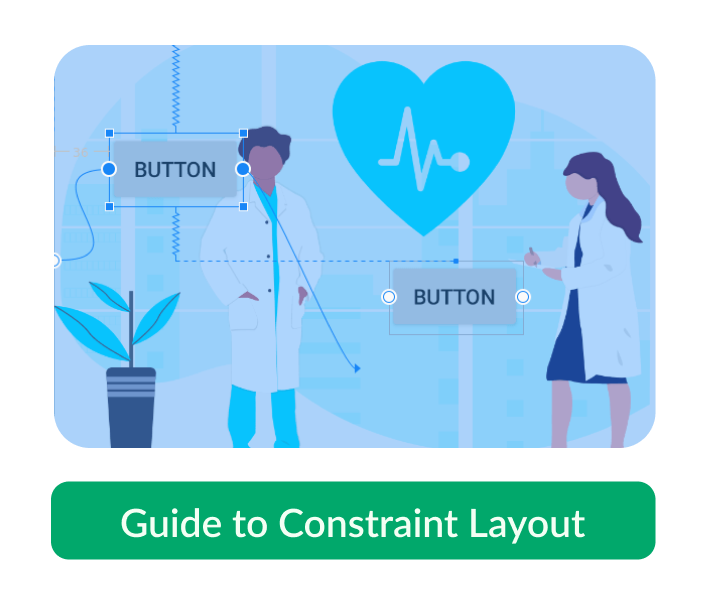

<!-- 

 
 -->

👋 Hey there, I'm Eric – an `Android` developer and `UI/UX` designer.

Crafting seamless tech experiences is my forte. Join me in the world of code and design on GitHub! 🚀🎨

<!--

  
  
  

-->

Oh, and I've also penned down a few insights in `articles` 🚀🎨📝

<table>
    <tr>
        <td>
            
        </td>
        <td>
            
        </td>
        <td>
            
        </td>
    </tr>
</table>

  

 

